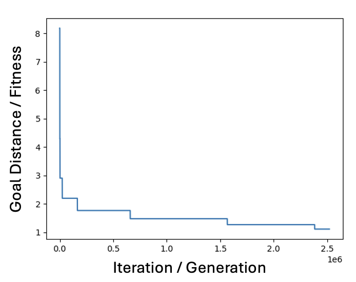

# Homework 3

## Grade
3 Points
1 points for code
1 point for README being accurate (see bottom)
1 point for being functionally correct

## Data
Datasets are in the data directory and same format

## Instructions
For this homework, please implement the genetic algorithm
and greedy best first search approach to find mapping functions (as we did in hw2).

To get started, please see the python files (genetic_algo.py and greed_best_first_search.py) and the TODOs in each.

For each algorithm approach, create a graph with "goal score" or "fitness function" on y-axis
and "iteration" or "generation" on x-axis. Which algorithm was faster?

Your graphs should be similar to this:

Save your graphs to the graphs directory

Commit your graphs and code to GitHub by the due date.

## Bonus
### 1
(+1 point to total )
For genetic algorithm, writeup an analysis of the impacts of what different
cross-overs have on how fast a child is found. Commit your writeup as Analysis.md
in your repo.

### 2
(+2 point to total )
Get both algorithms to work on data_bonus.json

## ADD your directions to run code here!!

